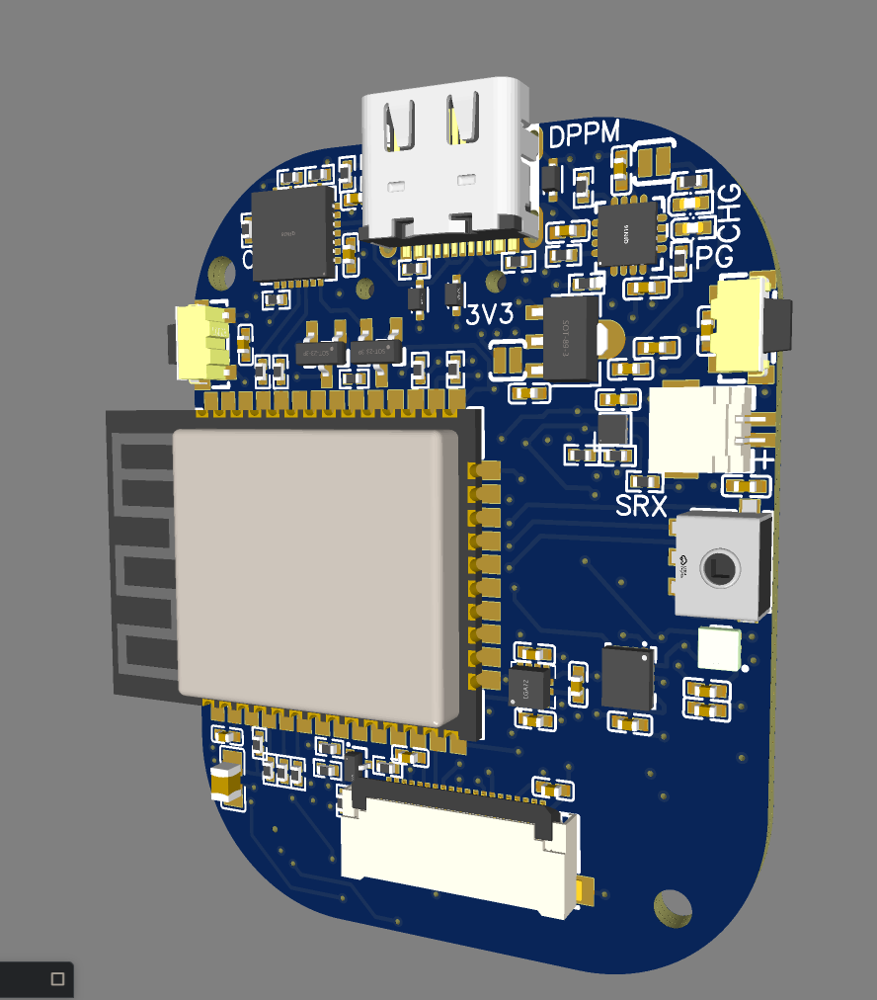

# ESPip-Boy
A smart watch based on the ESP32

# Features
* ESP32 MCU with full Bluetooth Classic
* SD Card storage
* TFT RGB Display
* Flashlight
* Microphone
* Sensors
  * Heart Rate & Blood Oxygen
  * Light Sensor (Auto Display Brightness)
  * Accelerometer (Auto Wakeup, Gestures) 
  * Magnetometer  (Compass)
* Controlled with Push-Button Rotary Encoder

# Planned Applications
* Compass
* Pedometer
* Map/Photo Display
* Clock
* Heart Rate Monitor
* Music Playback
* Bluetooth Manager
* System Monitor (CPU Tasks, SD Storage, RAM Usage etc.)

Powered by a LiPo, charged and programmed over USB

# V1.0 PCB Complete

