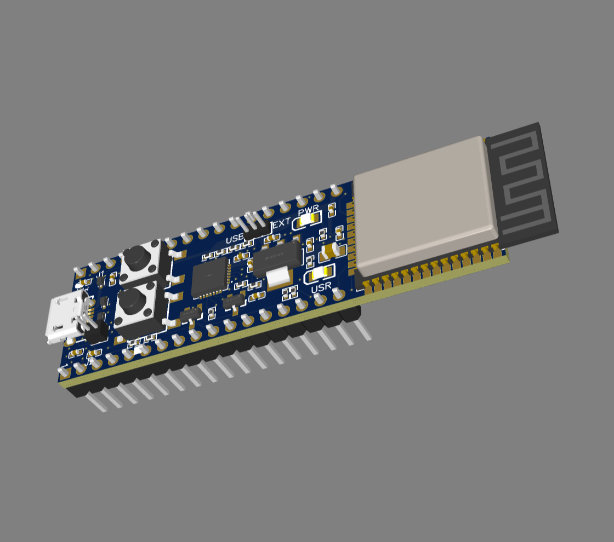

# August 19 2025 - Tuesday 12:42 AM
I am finally breadboarding my watch as one unit. SPI bus with SD card and TFT
display, I2C bus with MPU 6050, light sensor and heart rate monitor. Soon I will
reinstall my EC11 and make a menu on the TFT display for the user to select an
app: clock, heart rate display, compass ( if I use the magnetometer chip -
currently I have the MPU6050 installed. I want a 9 axis IMU haha ). Very
exciting!

# August 16 2025 - Saturday 09:39 PM
The EC11 schematic is complete! I have wired, tested, watch an episode of
Shogun, and drew the implementation of the EC11. Very simple, and I added +3V3
pullups to the input pins 34 and 35 as they do not have built-in pullups. 

This is an efficient use of pins because these are input only, and I won't/can't
use these for SPI and I2C peripherals, saving GPIO resources.

Currently I am researching the part of the project I understand the least about:
LiPo/Li-Ion battery circuits. I understand I will have a Micro USB port with 5V
going into a TP4056 charging IC with indicator LEDS. I will have this connected
somehow? to a DW01 protection IC to stop over/undercurrent of my lipo. 

The final thing I want, which is detailed nicely in this video, [Load Sharing
with
LiPos](https://www.youtube.com/watch?v=wy516po6uVU&ab_channel=MicroTypeEngineering)is
load sharing. Load sharing is a concern when you are charging an integral
battery because the charging circuit senses current to tell when the battery is
finished charging. If you have your load connected, it will draw current and
tell the charging IC the battery is not fully charged yet, resulting in the
battery being constantly trickle charged when plugged in to USB. 

The simplest solution presented in the video, which I would like to implement,
is adding a transistor controlled by VBUS which disconnects the load when
VBUS is high. 

After today and seeing how comfortable I am with designing after physically
testing, poking and prodding the components, I will order some of these
battery ICs and LiPos in order to test and learn more about them.

# August 16 2025 - Saturday 03:10 PM
I was stuck on my EC11 schematic today, surprised at the lack of information. I
decided, having purchased one already, the best thing would be to interface with
it and see how it works.

OMG the EC11 is a way different beast than I thought. OMG even the switch is
more complicated than I thought. Today I learn about quadrature encoding: the
way the EC11 rotary encoder encodes position into a signal. 

The digital pins into a rotary encoder and pulled high, and depending on the
rotation of the knob, the output signal to GND will be in a different phase. Pin
A will be leading if it rotated towards A and Pin B will lead in phase if the
knob rotated towards B. 

What the hell hahah, I did not expect this. 

Even the switch on the EC11 was more complicated than I thought, requiring me to
enable the digital output to GND through the switch as an INPUT_PULLUP, and then
monitoring the pin for when it is being pulled to ground. 

This will be a great experience item to use as an RTOS task, to monitor the
EC11, perhaps with interrupts, so that I have a responsive display while
multitasking.

Now that I understand the EC11, I will make my schematic for it!

* [ESP_Knob Lib](https://github.com/esp-arduino-libs/ESP32_Knob)
* [Button Tutorial](https://docs.arduino.cc/tutorials/generic/digital-input-pullup/)
* [Incremental Encoders and Quadrature Encoding Wikipedia Page](https://en.wikipedia.org/wiki/Incremental_encoder)

# August 16 2025 - Saturday  1:12 PM
    Wow, it's been a while. I have been super busy since I came back from
Japan.  In order to keep the dream alive, I planned to get to work on my
schematic and PCB this weekend and boy did I.

Yesterday, I spent about 10 hours doing 2.5 hours of Robert Feranac's tutorial
on designing an ESP32 development board schematic and doing PCB place and
route.  What an absolute monster of a tutorial.
I can't remember the last time I focused on a project for that long in one day
haha.

But the tutorial paid off, and today I am finally working on the ESPip-Boy's
schematic! I have copied and pasted the ESP32 board from the tutorial and
I have added labels for the components I am missing. Mostly sensors, battery
charging/protection and the rotary encoder switch and I am currently working
on.  [EC11 Schematic](https://electronics.stackexchange.com/questions/512042/does-ec11-incremental-encoder-need-hardware-debouncing-and-vcc-for-encoder)

It is so exciting to have finally reached this point in the project!

# August 1 2025 - Saturday 4:18 PM

  It is now August and I can say the real work has begun. The spectactular
dreaming phase is over and it is time to put my nose to the grindstone. To stop
being afraid of the unknown work ahead and to just do it! Today I started with
a simple 5 minutes of placing most of the labels for the USB Serial convertor.
Unfortunately that's all I could handle before becoming quite tired.

I will blame it on my jet lag from my 2 week Japan trip haha.

But that's the goal. Just chipping away at it every day, little by little.

I can already see the improvement in my PCB design skills, taking what I've
learned from the first 25 mins of Robert Feranac's ESP32 Dev Board video and
doing it on my own with no handholding, just referencing and making sure I am
on the right track.

This is very exciting for something I've never done before, watching my own
skills develop before my eyes! Here's to patience and curiosity as I walk this
unknown path!
